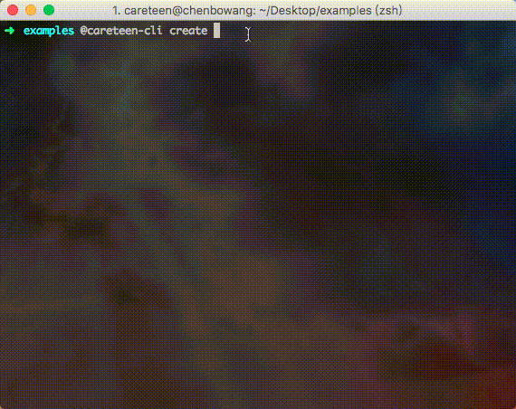
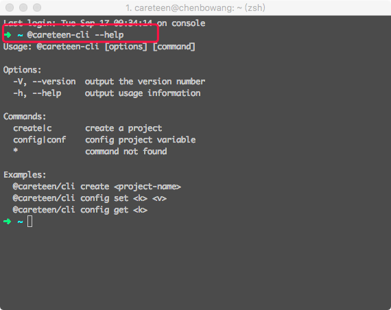
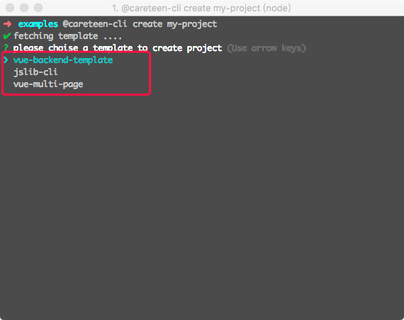

# [@careteen-cli](https://github.com/careteenL/cli)
[](https://github.com/careteenL/cli)
[](https://github.com/careteenL/cli/blob/master/LICENSE)
[](https://travis-ci.org/careteenL/cli)
[](https://www.npmjs.com/package/@careteen/cli)
[](http://www.npmtrends.com/@careteen/cli)

🚀模板项目脚手架


## 快速使用
NPM
```shell
npm i -g @careteen/cli
```
THEN



## 使用文档

### 全局安装
```shell
npm i -g @careteen/cli
```

### 查看所有命令帮助
```shell
@careteen-cli --help
```


### 下载项目
```shell
@careteen-cli create my-project
```


目前提供三个模板项目

- [jslib-cli JavaScript第三方库模板](https://github.com/careteenL/jslib-cli)
- [vue-multi-page Vue多页面系统模板](https://github.com/careteenL/vue-multi-page)
- [vue-backend-template Vue后台管理系统模板](https://github.com/careteenL/vue-backend-template)

各取所需...

## issue模板
- [Issue Template](./ISSUETEMPLATE.md)

## 贡献者
- [Contributors](https://github.com/careteenL/cli/graphs/contributors)

## 更新日志
- [Changelog](./CHANGELOG.md)

## 计划
- [Todo](./TODO.md)
